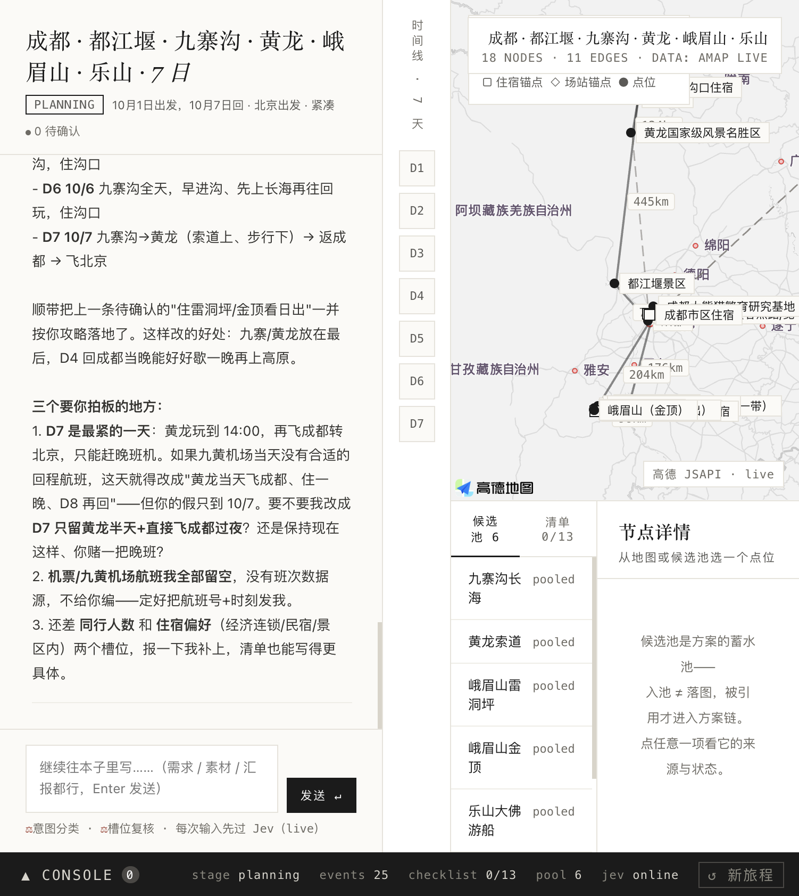
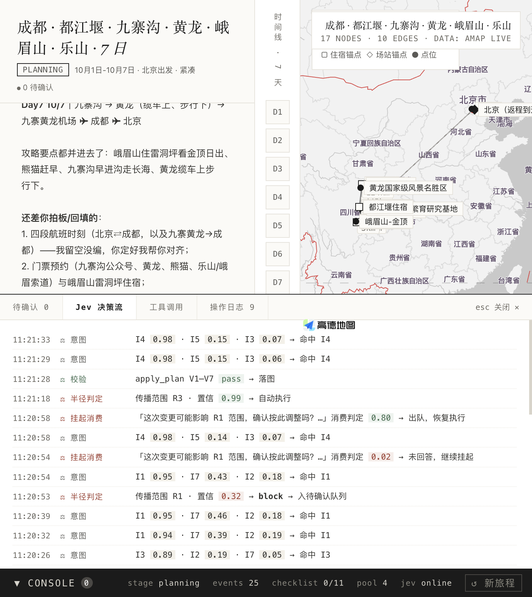
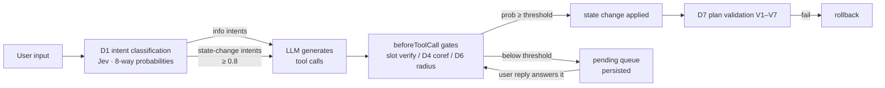

# Riddle — An Agent-Based Travel-Planning Copilot

> 中文文档 → [README.zh-CN.md](README.zh-CN.md)

Named after Tom Riddle's diary: a notebook that writes back. You pour in travel
materials, constraints and progress reports in natural language; Riddle keeps a
structured trip graph (days · events · routes · checklist) and answers with a
living plan.

**Core idea: generation and judgment are separate systems.**

- **LLM** (DeepSeek / Claude / OpenAI / GLM / any OpenAI-compatible endpoint) — only *generates*: conversation, plan drafts, tool calls.
- **Jev** ([TypeSafe System One](https://www.typesafe.ai/)) — makes every *judgment*: intent classification, slot verification, coreference resolution, change-propagation radius, plan validation. Each judgment returns a probability; anything below threshold is blocked and escalated to a pending question for the user.
- **pi-agent-core** — the agent loop; Jev hooks into three injection points (`transformContext`, `beforeToolCall`, `prepareNextTurn`).
- **AMap (高德)** — geographic ground truth: POI search, driving routes, distances.



## Why

LLMs happily *claim* they changed something, accept constraints you never gave,
and silently rewrite a 7-day itinerary because one hotel changed. Riddle is
fail-closed: **no state changes without a Jev judgment above threshold**, and
every borderline case becomes an explicit question in a persistent pending
queue instead of a silent guess.

## Features

- **Three-system architecture** — generation (LLM) / judgment (Jev) / orchestration (pi-agent-core) are independently swappable.
- **Gated state changes** — slot updates, plan application, and progress confirmation all pass Jev gates (with per-gate thresholds) before taking effect.
- **Entity-level checklist** — when you say "hotel booked, train tickets grabbed", Jev re-judges *each* checklist item against your exact words and only checks off what you actually mentioned; the rest goes to a confirm queue.
- **Pending queue** — blocked operations become explicit questions, persisted to disk (survives restarts), and consumed when your reply semantically answers them.
- **D6 propagation radius** — changing one event triggers a Jev judgment of how far the change should ripple (R1 local → R3 whole chain), with human confirmation for wide impacts.
- **Semantic plan validation (V1–V7)** — every submitted plan is reviewed by Jev (day coverage, anchor consistency, feasibility…) and rolled back on failure.
- **Full audit memory** — event-sourced op log, snapshots, one-click undo.
- **Live observability** — a side console streams every Jev judgment with probabilities, gate decisions, and queue activity in real time.
- **Multi-project notebook UI** — several trips in parallel, each with isolated state, conversation and event stream.
- **Settings center** — all keys configurable in-app with one-click connectivity tests (LLM / Jev / AMap / Baidu), hot-applied without restart.
- **Hybrid map data** — AMap serves map tiles, POI search and same-city driving; Baidu Direction v2 serves intercity transit with **real train/flight numbers, schedules and prices** (G321, CA4113…), all in one GCJ02 coordinate space, no conversion layer.



## Quick start

Requires Node.js ≥ 20.

```bash
cd APP
npm install
cp ../.env.example ../.env   # then fill in your keys (or configure in the UI)
npm run serve                # → http://localhost:8787
```

You need three kinds of keys (all can be entered in the in-app Settings panel,
with connectivity tests):

| Key | Where to get it | Used for |
|---|---|---|
| Jev API key | [TypeSafe AI](https://www.typesafe.ai/) | all judgments (required) |
| LLM key | DeepSeek / Anthropic / OpenAI / GLM… | generation (required) |
| AMap keys | [高德开放平台](https://lbs.amap.com/) — one *Web服务* key + one *Web端(JS API)* key with its security code | POI search / routing / map tiles |
| Baidu AK | [百度地图开放平台](https://lbs.baidu.com/) — one *服务端* AK | intercity train/flight/coach (optional; without it intercity legs degrade to blank-for-user) |

Then just talk to it: *"国庆想去重庆玩 6 天，成都出发，两个人，节奏慢一点"* →
watch Jev gate every slot, then ask it to generate a plan, report
*"酒店订好了"* and see only the lodging item get checked.

## Repository layout

```
APP/            TypeScript application (agent loop, Jev client, tools, server)
  src/agent.ts        pi-agent-core assembly + Jev injection points
  src/jev/            Jev client & all judgment questions/thresholds
  src/memory/         trip graph store (event sourcing, undo, persistence)
  src/scheduler/      stage machine + persistent pending queue
  src/tools/          AMap (POI/driving) + Baidu (intercity transit) tools
  src/server.ts       multi-project server (SSE event stream, settings API)
  scripts/            Jev regression (test-d4) + Baidu transit regression (test-baidu)
UI/app.html     the notebook UI (single file, no build step)
SPEC/           architecture & judgment-system design docs (Chinese)
ARCHIVE/        exploration lineage & reference material: RAWIDEAS → ANALYSIS → PRD → LAB prototypes → KB API docs (see ARCHIVE/README.md)
```

## How a turn works



## Roadmap

- Plan-quality evaluation harness & threshold calibration
- City-validation for LLM-hallucinated POI names

## License

MIT
