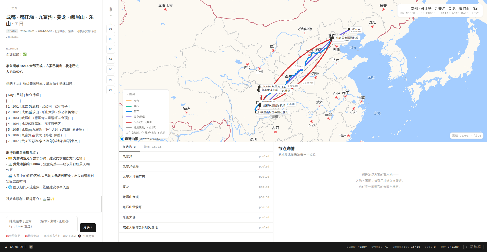
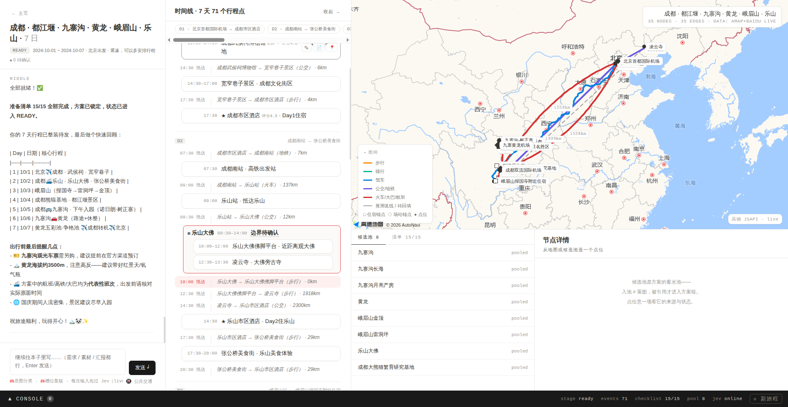
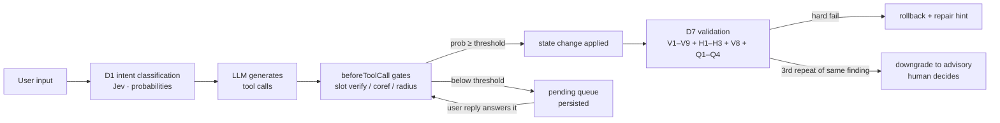

# Riddle — An Agent-Based Travel-Planning Copilot

> 中文文档 → [README.zh-CN.md](README.zh-CN.md)

Named after Tom Riddle's diary: a notebook that writes back. You pour travel
wishes, materials and progress reports into it in natural language; Riddle keeps
a structured trip graph (days · events · routes · checklist) and writes back
with a living, editable plan — on a map.

**Core idea: generation and judgment are separate systems.**

- **LLM** (DeepSeek / Claude / OpenAI / GLM / any OpenAI-compatible endpoint) — only *generates*: conversation, plan drafts, tool calls.
- **Jev** ([TypeSafe System One](https://www.typesafe.ai/)) — makes every *judgment*: intent classification, slot verification, coreference resolution, change-propagation radius, plan validation. Each judgment returns a probability; below threshold it is blocked and escalated to an explicit question.
- **pi-agent-core** — the agent loop; Jev hooks into three injection points (`transformContext`, `beforeToolCall`, `prepareNextTurn`).
- **AMap + Baidu Maps** — geographic ground truth: POI search, same-city routing, and intercity transit with real train/flight numbers.



## Why

LLMs happily *claim* they changed something, accept constraints you never gave,
silently rewrite a 7-day itinerary because one hotel changed — and once
cheerfully routed a traveler to a same-named temple **2,600 km away** (yes,
that really happened; it's why v0.6 exists). Riddle is fail-closed: **no state
changes without a Jev judgment above threshold**, and every borderline case
becomes an explicit question in a persistent pending queue instead of a silent
guess.

## Features

**Trustworthy by construction**

- **Three-system architecture** — generation (LLM) / judgment (Jev) / orchestration (pi-agent-core) are independently swappable.
- **Gated state changes** — slot updates, plan application, and progress confirmation all pass Jev gates (per-gate thresholds) before taking effect.
- **Entity-level checklist** — say *"hotel booked, tickets grabbed"* and Jev re-judges *each* item against your exact words; only what you actually mentioned gets checked off, the rest goes to a confirm queue.
- **Pending queue** — blocked operations become explicit questions, persisted to disk, consumed when your reply semantically answers them.
- **Full audit memory** — event-sourced op log, snapshots, one-click undo; safety-latched so the agent can never eat historical ops with a stray rollback.

**A plan you can actually look at and touch**

- **Event-tree itinerary** — every plan is a tree of `poi` (points) / `route` (legs) / `aoi` (areas, e.g. a scenic area containing its spots and inner shuttles), rendered as a timeline with AOI frames plus a live map with real route polylines.
- **Co-editing (v0.5)** — hover any event to edit its time, pin it (🔒), drag to reorder, or insert a POI onto a route leg. Three-layer time sovereignty: pinned times are never touched by the LLM, your soft edits are respected with an audit trail, everything else is derived.
- **Event wiki** — every event carries a two-layer doc (LLM notes + your notes) for tickets, booking numbers, tips.

**Geographic sanity (v0.6)**

- **H1–H3 hard checks, zero LLM cost** — a scenic-area child 50 km away from its siblings, a POI resolving outside the trip's administrative whitelist, or a "walking" leg over 20 km are rejected with the exact coordinates, the whitelist, and the re-query hint, so the model fixes it in one shot.
- **Anti-deadlock** — the same finding failing 3 times in a row is downgraded to an advisory and handed to a human; validation never traps the planner in a reject loop.
- **V9 soft check** — one extra question piggybacked on the validation batch: "do the resolved places semantically match the traveler's intent?" Advisory only.
- **Unconventional legs without APIs** — cable cars (straight line), ferries/sightseeing boats (river arc), and park shuttles (park-road arc) get plausible geometry, distance and duration with no API call, rendered dashed and labeled as estimates.
- **Batched plan submission** — large itineraries are submitted in idempotent per-day segments; a validation failure keeps the buffer and only the broken segment is retried.

**Operations-friendly**

- **Live observability** — a side console streams every Jev judgment with probabilities, gate decisions, and queue activity in real time.
- **Multi-project notebook UI** — several trips in parallel, each with isolated state, conversation and event stream.
- **Settings center** — all keys configurable in-app with one-click connectivity tests (LLM / Jev / AMap / Baidu), hot-applied without restart.
- **Hybrid map data** — AMap for tiles/POI/same-city routing; Baidu Direction v2 for intercity legs with **real train/flight numbers, schedules and prices** (G321, CA4113…), all in one GCJ02 coordinate space.



## Quick start

Requires Node.js ≥ 20.

```bash
git clone https://github.com/evanpanlabs-design/riddle_trip_planner.git
cd riddle_trip_planner/APP
npm install
cp ../.env.example ../.env   # then fill in your keys (or configure in the UI)
npm run serve                # → http://localhost:8787
```

You need three kinds of keys (all can be entered in the in-app Settings panel,
with connectivity tests):

| Key | Where to get it | Used for |
|---|---|---|
| Jev API key | [TypeSafe AI](https://www.typesafe.ai/) | all judgments (required) |
| LLM key | DeepSeek / Anthropic / OpenAI / GLM… | generation (required) |
| AMap keys | [高德开放平台](https://lbs.amap.com/) — one *Web服务* key + one *Web端(JS API)* key with its security code | POI search / routing / map tiles |
| Baidu AK | [百度地图开放平台](https://lbs.baidu.com/) — one *服务端* AK | intercity train/flight/coach (optional; without it intercity legs degrade to estimates) |

Then just talk to it:

1. *"国庆想去重庆玩 6 天，成都出发，两个人，节奏慢一点"* — watch Jev gate every slot.
2. *"帮我出个方案"* — the plan lands on the map and timeline; large trips arrive in batched segments.
3. Drag a spot, pin a time, edit a route's mode — your edits survive the next regeneration.
4. Report *"酒店订好了"* and see only the lodging item get checked.

## Repository layout

```
APP/            TypeScript application (agent loop, Jev client, tools, server)
  src/agent.ts        pi-agent-core assembly + Jev injection points + apply/validation pipeline
  src/jev/            Jev client & all judgment questions/thresholds
  src/memory/         event-tree store (event sourcing, undo), co-editing ops, geo checks
  src/scheduler/      stage machine + persistent pending queue
  src/tools/          AMap (POI/routing) + Baidu (intercity transit/place) tools
  src/server.ts       multi-project server (SSE event stream, editing & settings APIs)
  scripts/            regression suites (v2 logic, Jev, Baidu transit)
UI/app.html     the notebook UI (single file, no build step)
SPEC/           architecture & judgment-system design docs (Chinese)
docs/demo/      feature screenshots
ARCHIVE/        exploration lineage & reference material (RAWIDEAS → ANALYSIS → PRD → LAB → KB)
```

## How a turn works



## Roadmap

- Plan reasonableness: direction-of-travel within scenic areas, schedule feasibility, pacing
- Lowering the learning curve: fewer concepts between the user and a good trip
- LLM/LBS budget accounting per planning session

## License

MIT
