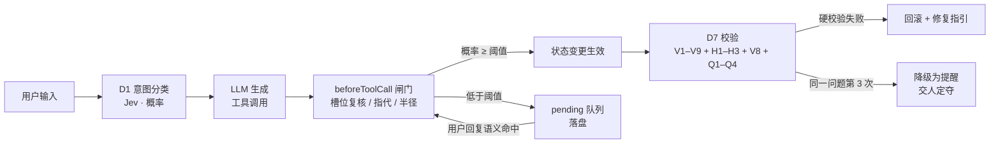

# Riddle — 基于 Agent 的旅行规划副驾

> English → [README.md](README.md)

名字来自汤姆·里德尔的日记：一本会回写的笔记本。你用自然语言往里倒旅行愿望、
素材和进展汇报，Riddle 在背后维护一张结构化行程图（天 · 事件 · 路线 · 清单），
回给你一个活的、能在地图上直接动手改的方案。

**核心理念：生成与判断是两个系统。**

- **LLM**（DeepSeek / Claude / OpenAI / GLM / 任意 OpenAI 兼容端点）——只负责*生成*：对话、方案草案、工具调用。
- **Jev**（[TypeSafe System One](https://www.typesafe.ai/)）——负责一切*判断*：意图分类、槽位复核、指代消解、改动传播半径、方案校验。每个判断都返回概率，低于阈值就拦截，升级为一个明确的问题问你。
- **pi-agent-core**——agent 主循环；Jev 嵌进三个注入点（`transformContext`、`beforeToolCall`、`prepareNextTurn`）。
- **高德 + 百度地图**——地理事实源：POI 搜索、同城路线、跨城真实班次（含车次/航班号）。


## 为什么做这个

LLM 会面不改色地*声称*自己改过了东西、接受你没给过的约束、因为你换了一家酒店
就把七天行程悄悄重写——还真干过把游客导去 2600 公里外同名寺庙的事（凌云寺惨案，
v0.6 就是为它做的）。Riddle 的原则是 fail-closed：**不过 Jev 阈值，状态一律不变**；
一切拿不准的情况都变成 pending 队列里一个明确的问题，而不是悄悄猜一个。

## 功能

**可信是设计出来的**

- **三系统架构**——生成（LLM）/ 判断（Jev）/ 编排（pi-agent-core）各自独立可替换。
- **状态变更全部过闸**——槽位更新、方案落图、进展确认，先过 Jev 判断（各有阈值）再生效。
- **实体级清单核对**——你说"酒店订了、票抢到了"，Jev 拿你的原话逐条重判每个清单项，只勾掉你真说到的，其余进确认队列。
- **pending 队列**——被拦的操作变成显式问题，落盘持久化，你的回复语义上回答了它才会被消费。
- **完整审计记忆**——event sourcing 操作日志、快照、一键 undo；带安全闩，agent 误用 rollback 也吃不掉历史操作。

**方案看得见、摸得着**

- **事件树行程**——方案是一棵 `poi`（点）/ `route`（线）/ `aoi`（面，景区套着园内点位和内部通勤）的树，渲染成带 AOI 框的时间线，旁边是画着真实路径折线的活地图。
- **共创编辑（v0.5）**——悬停任何事件即可改时间、钉住（🔒）、拖拽重排、在通勤段上插途经点。三层时间主权：钉住的时间 LLM 永不能碰，你的软修改被尊重且留痕，其余交给系统派生。
- **事件 wiki**——每个事件带双层文档（LLM 笔记 + 你的笔记），放票务、预约号、小贴士。

**地理合理性（v0.6）**

- **H1–H3 硬校验，零 LLM 成本**——景区子景点离兄弟点位 50 公里以上、点位落在行程行政区划白名单外、"步行"段超过 20 公里，直接打回；打回文案带错误坐标、白名单和重查关键词，模型一次改对。
- **防抱死**——同一个问题连续打回 3 次自动降级为提醒、交人定夺，校验绝不会把规划卡进死循环。
- **V9 软校验**——搭校验批量的便车多问一句"查到的点和游客意图是不是一回事"，只提醒不拦截。
- **无 API 的非常规通勤**——索道（直线）、摆渡船/观光船（河道弧线）、景交车（园区路弧线）都有合理的几何、距离和耗时，零接口调用，虚线呈现并标注为估计值。
- **大行程分批落图**——长行程按天分段幂等提交；校验打回保留缓冲，只重提出错的那一段。

**运维友好**

- **实时可观测**——侧边控制台流式展示每条 Jev 判断：概率、闸门决策、队列活动。
- **多项目笔记本 UI**——多个行程并行，各自独立的状态、对话和事件流。
- **设置中心**——所有 key 界面可配、一键连通性测试（LLM / Jev / 高德 / 百度），热生效免重启。
- **双图 Hybrid**——高德出底图/POI/同城算路；百度 Direction v2 出跨城段**真实车次/航班、时刻与价格**（G321、CA4113…），统一 GCJ02 坐标系无转换层。


## 快速开始

需要 Node.js ≥ 20。

```bash
git clone https://github.com/evanpanlabs-design/riddle_trip_planner.git
cd riddle_trip_planner/APP
npm install
cp ../.env.example ../.env   # 填入你的 key（也可以进界面再配）
npm run serve                # → http://localhost:8787
```

需要三类 key（都可以在应用内设置面板配置，带连通性测试）：

| Key | 获取地址 | 用途 |
|---|---|---|
| Jev API key | [TypeSafe AI](https://www.typesafe.ai/) | 一切判断（必需） |
| LLM key | DeepSeek / Anthropic / OpenAI / GLM… | 生成（必需） |
| 高德 key | [高德开放平台](https://lbs.amap.com/)——一个 *Web服务* key + 一个 *Web端(JS API)* key 及安全密钥 | POI 搜索 / 算路 / 底图 |
| 百度 AK | [百度地图开放平台](https://lbs.baidu.com/)——一个*服务端* AK | 跨城火车/航班/大巴（可选；没有则跨城段降级为估计） |

然后直接跟它说话：

1. *"国庆想去重庆玩 6 天，成都出发，两个人，节奏慢一点"*——看 Jev 逐个槽位过闸。
2. *"帮我出个方案"*——方案落到地图和时间线上，大行程会自动分批到达。
3. 拖一个点位、钉一个时间、改一段交通方式——你的编辑在下次重新生成后依然有效。
4. 汇报*"酒店订好了"*——只有住宿那一项被勾掉。

## 仓库结构

```
APP/            TypeScript 应用（agent 主循环、Jev 客户端、工具、服务端）
  src/agent.ts        pi-agent-core 装配 + Jev 注入点 + 落图/校验管线
  src/jev/            Jev 客户端与全部判断问题/阈值
  src/memory/         事件树存储（event sourcing、undo）、共创编辑 op、地理校验
  src/scheduler/      阶段机 + 持久化 pending 队列
  src/tools/          高德（POI/算路）+ 百度（跨城班次/地点富化）工具
  src/server.ts       多项目服务端（SSE 事件流、编辑与设置 API）
  scripts/            回归测试（v2 逻辑、Jev、百度班次）
UI/app.html     笔记本 UI（单文件，无构建）
SPEC/           架构与判断系统设计文档（中文）
docs/demo/      功能截图
ARCHIVE/        探索脉络与参考资料（RAWIDEAS → ANALYSIS → PRD → LAB → KB）
```

## 一轮对话如何运转



## Roadmap

- 方案合理性：景区内动线方向、班次可行性、节奏与体力
- 降低理解成本：让用户和好行程之间的概念更少
- 单次规划会话的 LLM/LBS 资源账单

## License

MIT
