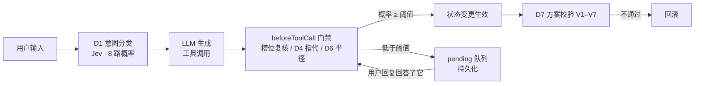

# Riddle — 基于 Agent 的旅行规划 Copilot

> English → [README.md](README.md)

名字来自汤姆·里德尔的日记本：一本会回应的笔记本。你用自然语言倒入旅行素材、
约束和进度汇报，Riddle 在背后维护一张结构化的旅行图（天数 · 事件 · 路线 ·
准备清单），并给出持续生长的方案。

**核心理念：生成与判断是两个系统。**

- **LLM**（DeepSeek / Claude / OpenAI / GLM / 任意 OpenAI 兼容端点）——只负责*生成*：对话、方案草案、工具调用。
- **Jev**（[TypeSafe System One](https://www.typesafe.ai/)）——负责一切*判断*：意图分类、槽位复核、指代消解、变更传播半径、方案校验。每个判断都返回概率，低于阈值一律拦截，升级为 pending 问题交给用户裁决。
- **pi-agent-core** —— agent 主循环；Jev 嵌入三个注入点（`transformContext`、`beforeToolCall`、`prepareNextTurn`）。
- **高德地图** —— 地理事实层：POI 搜索、驾车路线、距离测算。


## 为什么这么做

LLM 会很自然地"声称"自己改了什么、接受你根本没给过的约束、因为一家酒店
变更就悄悄重写整个 7 天行程。Riddle 是 fail-closed 的：**任何状态变更都必须
有 Jev 判断过阈值**，所有拿不准的情况都变成 pending 队列里的显式问题，而不是
一次沉默的猜测。

## 功能特性

- **三系统架构** —— 生成（LLM）/ 判断（Jev）/ 编排（pi-agent-core）可独立替换。
- **门禁式状态变更** —— 槽位更新、方案落图、进度确认都要过 Jev 门禁（各有独立阈值），过了才生效。
- **实体级清单勾选** —— 你说"酒店订好了，高铁票也抢到了"，Jev 会拿你的原话逐项复核清单，只勾真正被提及的项；其余转入确认队列。
- **pending 队列** —— 被拦截的操作变成显式问题，持久化到磁盘（重启不丢），当你的回复在语义上回答了它时被消费。
- **D6 传播半径** —— 改动一个事件，Jev 判断变更应该传播多远（R1 局部 → R3 整链），大范围影响必须人工确认。
- **语义方案校验（V1–V7）** —— 每份提交的方案都经 Jev 审阅（天数覆盖、锚点一致性、可行性……），不通过即回滚。
- **全量审计记忆** —— event sourcing 操作日志、快照、一键撤销。
- **实时可观测** —— 侧边控制台实时流出每个 Jev 判断的概率、门禁决策和队列活动。
- **多项目笔记本 UI** —— 多个旅程并行，各自独立的状态、对话和事件流。
- **设置中心** —— 所有 key 可在界面配置，带一键连通性测试（LLM / Jev / 高德 / 百度），保存即热生效，无需重启。


## 快速开始

需要 Node.js ≥ 20。

```bash
cd APP
npm install
cp ../.env.example ../.env   # 填入你的 key（也可以在 UI 设置里配）
npm run serve                # → http://localhost:8787
```

需要三类 key（都可以在应用内设置面板填写，均带连通性测试）：

| Key | 获取地址 | 用途 |
|---|---|---|
| Jev API key | [TypeSafe AI](https://www.typesafe.ai/) | 全部判断（必需） |
| LLM key | DeepSeek / Anthropic / OpenAI / GLM… | 生成（必需） |
| 高德 key | [高德开放平台](https://lbs.amap.com/) —— 一个 *Web服务* key + 一个 *Web端(JS API)* key 及其安全密钥 | POI 搜索 / 路线规划 / 地图底图 |

然后直接跟它说话：*"国庆想去重庆玩 6 天，成都出发，两个人，节奏慢一点"* →
看 Jev 逐个门禁复核槽位；让它生成方案；汇报 *"酒店订好了"*，看只有住宿那一项
被勾掉。

## 仓库结构

```
APP/            TypeScript 应用（agent 主循环、Jev 客户端、工具、服务器）
  src/agent.ts        pi-agent-core 装配 + Jev 三个注入点
  src/jev/            Jev 客户端与全部判断问题/阈值定义
  src/memory/         旅行图存储（event sourcing、撤销、持久化）
  src/scheduler/      阶段机 + 持久化 pending 队列
  src/tools/          高德 Web 服务工具
  src/server.ts       多项目服务器（SSE 事件流、设置 API）
  scripts/test-d4.ts  清单指代消解的 Jev 级回归脚本
UI/app.html     笔记本 UI（单文件，无构建步骤）
SPEC/           架构与判断系统设计文档
```

## 一轮对话如何工作



## 路线图

- 混合地图数据：高德底图 + 百度大交通（火车/飞机）数据
- 方案质量评测机制与阈值标定
- LLM 生造 POI 名的城市校验

## License

MIT
